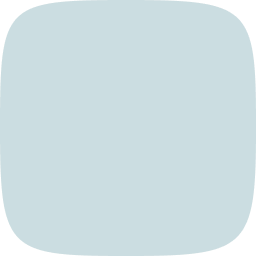

# 🌟 Angor Brand Book

**Angor** is an innovative decentralized crowdfunding platform built on the power of Bitcoin and blockchain technology. This brand book ensures consistent, professional representation of Angor across all media, including logos, icons, colors, and typography.

---

## 📚 Table of Contents

1. [Brand Overview](#brand-overview)
2. [Logos](#logos)
3. [Icons](#icons)
4. [Color Palette](#color-palette)
5. [Typography](#typography)
6. [Visual Guidelines](#visual-guidelines)
7. [Brand Applications](#brand-applications)
8. [Legal and Compliance](#legal-and-compliance)

---

## 1. Brand Overview

Angor is committed to providing a secure, transparent, and decentralized crowdfunding platform, allowing investors to manage their funds safely and founders to access a trustless funding solution.

---

## 2. Logos

Angor logos are available in a variety of formats and sizes to suit different media requirements. Please use the appropriate version depending on your needs:

### 🌑 Dark Theme Logos

- **Dark Logo 256px**  
    
  [Download](assets/logos/angor-logo-text-dark-256.png)

- **Dark Logo 512px**  
    
  [Download](assets/logos/angor-logo-text-dark-512.png)

- **Dark Logo 1024px**  
    
  [Download](assets/logos/angor-logo-text-dark-1024.png)

- **Dark Logo 2048px**  
    
  [Download](assets/logos/angor-logo-text-dark-2048.png)

### ☀️ Light Theme Logos

- **Light Logo 256px**  
    
  [Download](assets/logos/angor-logo-text-light-256.png)

- **Light Logo 512px**  
    
  [Download](assets/logos/angor-logo-text-light-512.png)

- **Light Logo 1024px**  
    
  [Download](assets/logos/angor-logo-text-light-1024.png)

- **Light Logo 2048px**  
    
  [Download](assets/logos/angor-logo-text-light-2048.png)

### ✨ Vector Logos

- [Download Dark Logo SVG](assets/logos/angor-logo-text-dark.svg)
- [Download Light Logo SVG](assets/logos/angor-logo-text-light.svg)

---

## 3. Icons

Angor’s icons are optimized for web and mobile applications, ensuring a consistent brand image. The following icons are available for use:

### 📱 Application Icons

- **App Icon Dark**  
    
  [Download](assets/icons/app/angor-app-icon-dark.png)

- **App Icon Light**  
    
  [Download](assets/icons/app/angor-app-icon-light.png)

### 🌐 Favicons

- **Favicon Light**  
    
  [Download](assets/icons/ico/angor-favicon-light.ico)

- **Favicon Dark**  
    
  [Download](assets/icons/ico/angor-favicon-dark.ico)

### Original Icons

- **Angor 256 Light**  
    
  [Download](assets/icons/original/angor-256-light.png)

- **Angor 256 Dark**  
    
  [Download](assets/icons/original/angor-256.png)

- **Angor 512 Light**  
    
  [Download](assets/icons/original/angor-512-light.png)

- **Angor 512 Dark**  
    
  [Download](assets/icons/original/angor-512.png)

- **Angor 1024 Light**  
    
  [Download](assets/icons/original/angor-1024-light.png)

- **Angor 1024 Dark**  
    
  [Download](assets/icons/original/angor-1024.png)

- **Angor 2048 Light**  
    
  [Download](assets/icons/original/angor-2048-light.png)

- **Angor 2048 Dark**  
    
  [Download](assets/icons/original/angor-2048.png)

---

## 4. 🎨 Color Palette

Angor’s color palette reflects the professional and forward-thinking nature of the brand. These colors are used throughout the website, marketing materials, and applications.

### Primary Colors

- **Very Dark Teal** (#022229)  
    
  [Download](assets/colors/022229.png)

- **Dark Cyan** (#086c81)  
    
  [Download](assets/colors/086c81.png)

- **Light Steel Green** (#cbdde1)  
    
  [Download](assets/colors/cbdde1.png)

---

## 5. ✏️ Typography

The **Inter** font family is used for all branding materials, ensuring a modern, clean, and readable look across digital and print media.

- [Download Inter Regular](assets/fonts/angor-inter-variablefont_opsz,wght.ttf)
- [Download Inter Italic](assets/fonts/angor-inter-italic-variablefont_opsz,wght.ttf)

Example of typography:  

---

## 6. 🎯 Visual Guidelines

### Logo Usage

- Maintain clear space around the logo to ensure it stands out.
- Do not stretch, rotate, or alter the proportions of the logo.
- Use the appropriate dark or light version depending on the background color.

### Color Usage

- Use **Very Dark Teal** as the main background or for large sections.
- Use **Dark Cyan** for highlights, buttons, and interactive elements.
- Use **Light Steel Green** for text or background highlights.

### Typography Usage

- Use **Inter** for headings and body text to ensure consistency.
- Minimum font size for web: 16px. Minimum size for print: 12pt.

---

## 7. 📄 Brand Applications

### Website

- Ensure consistency in applying logos, colors, and typography across all pages.
- Navigation should be clear and user-friendly, following the brand’s tone.

### Social Media

- Use the square version of the logo for profile pictures and avatars.
- Maintain the brand color palette and typography in promotional posts.

### Marketing Materials

- Apply logos, fonts, and colors as specified in all brochures, presentations, and advertisements.
- Always use vector logos for print materials to ensure clarity.

---

## 8. 📜 Legal and Compliance

- The Angor logo and brand elements must not be altered in any way.
- Ensure compliance with Angor’s intellectual property and trademark guidelines.
